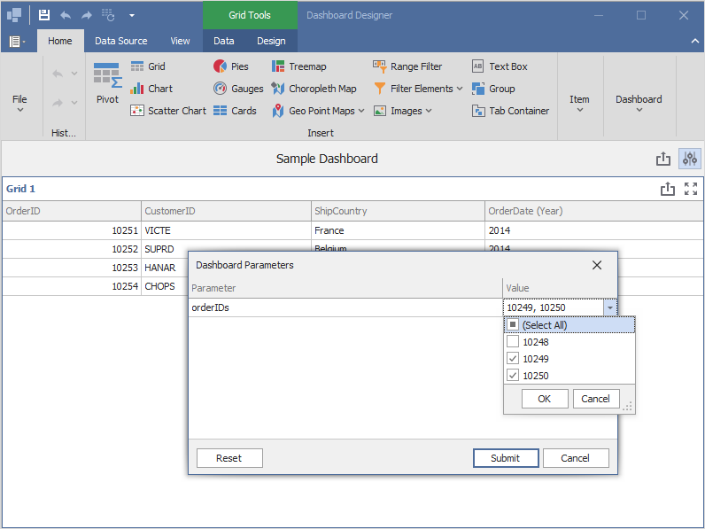
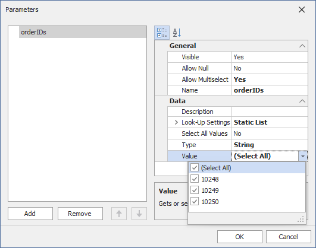
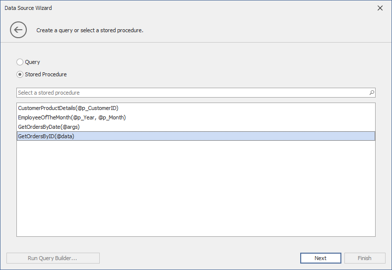
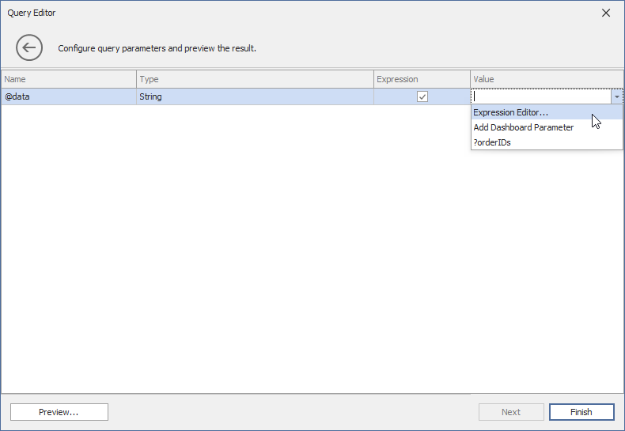
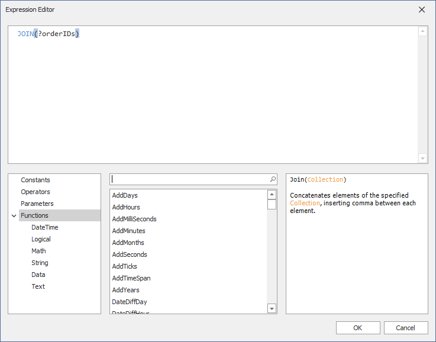

<!-- default badges list -->

[](https://supportcenter.devexpress.com/ticket/details/T1144408)
[](https://docs.devexpress.com/GeneralInformation/403183)
<!-- default badges end -->
# Dashboard for WinForms - How to Pass a Dashboard Parameter to a Stored Procedure

This example shows how to pass a [dashboard parameter](https://docs.devexpress.com/Dashboard/16169) to a [stored procedure](https://docs.devexpress.com/Dashboard/113946). In this example, the [DashboardDesigner.CustomParameters](https://docs.devexpress.com/Dashboard/DevExpress.DashboardWin.DashboardDesigner.CustomParameters) event is handled to change the dashboard parameter's default value before it is passed to the stored procedure.

In the result, only the values specified in the `CustomParameters` event are in effect.



## Example Overview

To pass a dashboard parameter to a stored procedure, do the following.

### Create a Dashboard Parameter

To create a dashboard parameter, click the **Parameters** button from the **Dashboard** page group on the Ribbon's **Home** page. Click **Add** to create a dashboard parameter.

In this example, the **orderIDs** dashboard parameter is created. Specify the following settings:

- Enable the `Allow Multiselect` property to select multiple values for the parameter.
- Set the `Look-up Settings` property to *Static List*. The following values are available for the parameter: 10248, 10249, 10250.
- Enable the `Select All` property to select all values in the initial state of the dashboard.



### Select a Stored Procedure

In the [Query Editor](https://docs.devexpress.com/Dashboard/115206/) dialog, select a [stored procedure](https://docs.devexpress.com/Dashboard/113946). In this example, the **GetOrdersByID** stored procedure from the **NWind.mdf** database is used.



On the next page, bind the query parameter to the dashboard parameter created earlier.

### Bind the Query Parameter to the Dashboard Parameter

You cannot pass a multi-value parameter value to a stored procedure directly. To pass a multi-value parameter to a stored procedure, convert the array of parameter values to a string with the JOIN() function if you use the Microsoft SQL Server, MySQL, or Oracle database system. The stored procedure code should parse the resulting string to get the dashboard parameter values.

To do this, on the second page of the Query Editor, enable the *Expression* check box for the query parameter. From the drop-down list in the **Value** column, select the *Expression Editor* option.



In the invoked **Expression Editor**, pass the name of the dashboard parameter (**?OrderIDS**) to the *JOIN()* function.



Click **OK** to apply the specified settings.

### Change the Default Parameter Value in Code

Handle the [DashboardDesigner.CustomParameters](https://docs.devexpress.com/Dashboard/DevExpress.DashboardWin.DashboardDesigner.CustomParameters) event and specify the value to be passed to the stored procedure.

```csharp
private void DashboardDesigner_CustomParameters(object sender, DevExpress.DashboardCommon.CustomParametersEventArgs e) {
	var customerIDsparam = e.Parameters.FirstOrDefault(p => p.Name == "orderIDs"); ;
	if (customerIDsparam != null) {
		customerIDsparam.Value = new string[] {"10251", "10252", "10253", "10254"} ;

	}
}
```

As a result, a user sees a dashboard based on the data from the stored procedure with the **data** query parameter's value specified in the `DashboardDesigner.CustomParameters` event handler (10251, 10252, 10253, 10254).

## Files to Review

* [DesignerForm1.cs](cs/DashboardParameters/DesignerForm1.cs) (VB: [DesignerForm1.vb](VB/DashboardParameters/DesignerForm1.vb))

## Documentation

- [Create a Dashboard Parameter](https://docs.devexpress.com/Dashboard/16169)
- [Reference Dashboard Parameters](https://docs.devexpress.com/Dashboard/16170)
- [Specify Dashboard Parameter Values](https://docs.devexpress.com/Dashboard/16171)
- [Stored Procedures](https://docs.devexpress.com/Dashboard/113946)

## More Examples

* [Dashboard for WinForms - Pass a Hidden Dashboard Parameter to a Custom SQL query](https://github.com/DevExpress-Examples/how-to-pass-a-hidden-dashboard-parameter-to-a-custom-sql-query-in-the-winforms-viewer-t338459)
* [Dashboard for WinForms - Pass a Dashboard Parameter to a Custom SQL Query in Code](https://github.com/DevExpress-Examples/how-to-pass-a-dashboard-parameter-to-a-custom-sql-query-in-code-e5120)
* [Dashboard for WinForms - Pass a Dashboard Parameter to a Filter String in Code](https://github.com/DevExpress-Examples/how-to-pass-a-dashboard-parameter-to-a-filter-string-in-code-e5117)
* [Dashboard for WinForms - Pass a Dashboard Parameter to a Calculated Field's Expression in Code](https://github.com/DevExpress-Examples/how-to-pass-a-dashboard-parameter-to-a-calculated-fields-expression-in-code-e5135)
* [Dashboard for WinForms - Specify Default Parameter Values in the WinForms Viewer](https://github.com/DevExpress-Examples/how-to-specify-default-parameter-values-in-the-winforms-viewer-t475858)
* [Dashboard for WinForms - Use Dashboard Parameters with the Expression Format Condition](https://github.com/DevExpress-Examples/how-to-usedashboard-parameters-with-the-expressionformat-condition-t260065)
* [Dashboard for WinForms - Manage Parameters in the WinForms Viewer](https://github.com/DevExpress-Examples/winforms-dashboard-how-to-manage-dashboard-parameters-in-code-t635871)
